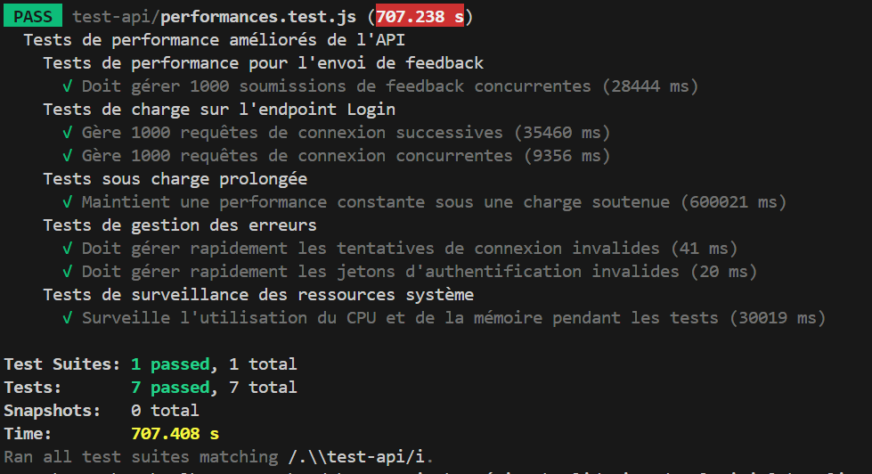

# Test de Performance de l'API

## Objectifs
Évaluer la capacité de l'API à maintenir des performances optimales sous une charge élevée, notamment :
- Simuler le trafic utilisateur
- Mesurer les temps de réponse sous différentes charges
- Surveiller l'impact sur les ressources système (CPU, mémoire)

## Scénarios de Test
Tests réalisés :
- Soumissions de feedback simultanées (1000 utilisateurs)
- Connexions successives et simultanées
- Charge prolongée pendant 10 minutes
- Tests de gestion des erreurs (identifiants et jetons invalides)
- Surveillance des ressources système

## Outils Utilisés
- **Jest** : Framework de test
- **Supertest** : Outil de requêtes HTTP
- **Node.js** : Environnement d'exécution
- **OS** : Surveillance des ressources système

## Résultats
- **Soumission de Feedback** : Temps moyen de 273.688ms pour 1000 soumissions.
- **Connexion Successives** : Temps moyen de 35.381ms.
- **Connexion Concurrentes** : Temps moyen de 273.531ms.
- **Charge Prolongée** : Temps moyen de 82.71ms.
- **Gestion des Erreurs** : Réponses rapides (connexion invalide : 36ms, jeton invalide : 14ms).
- **Ressources Système** : CPU à 0%, mémoire maximale 70.98 Mo.

## Analyse
- **Stabilité sous charge** : L'API maintient des temps de réponse stables même avec un grand nombre de requêtes simultanées.
- **Efficacité des ressources** : Utilisation du CPU très faible et gestion optimale de la mémoire.

## Conclusion
L'API gère efficacement une charge élevée tout en maintenant des performances constantes. Une surveillance continue des ressources est recommandée pour assurer la scalabilité.

## Bilan avec Keymetrics
- **CPU** : 0%
- **Mémoire** : 70.98 Mo
- **Heap Usage** : 94%

## Screenshot

**Auteur**: Raphaël Dimeck
